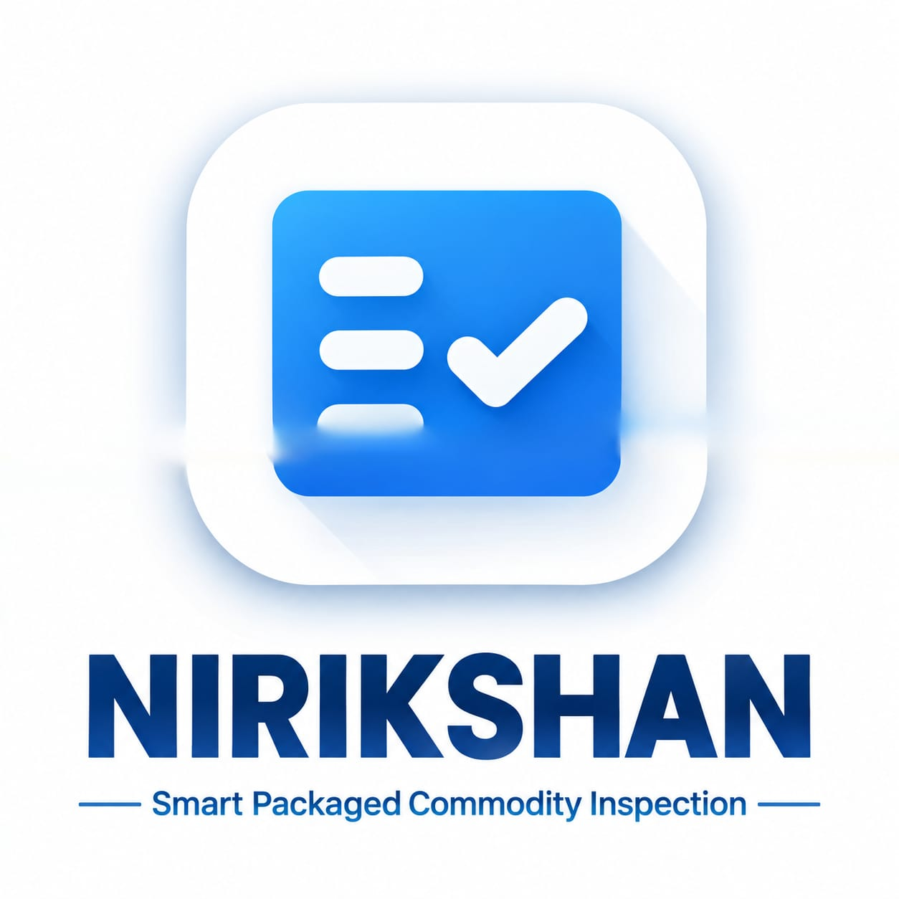
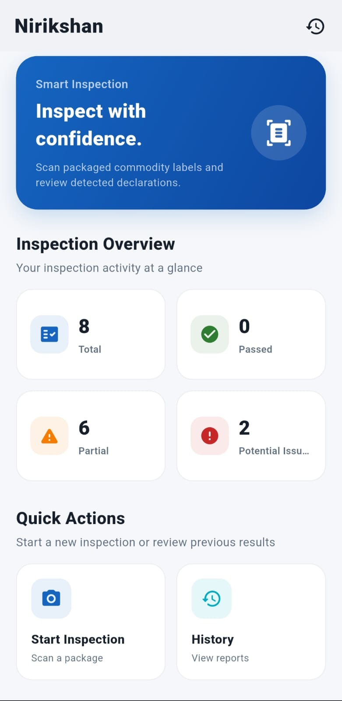
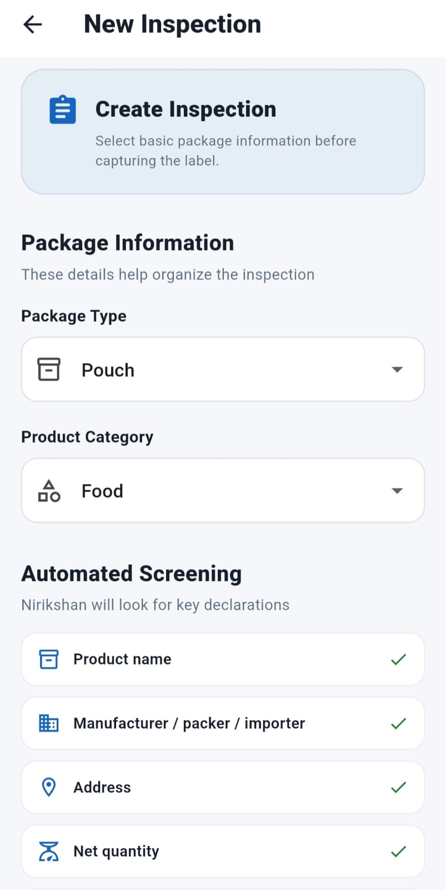
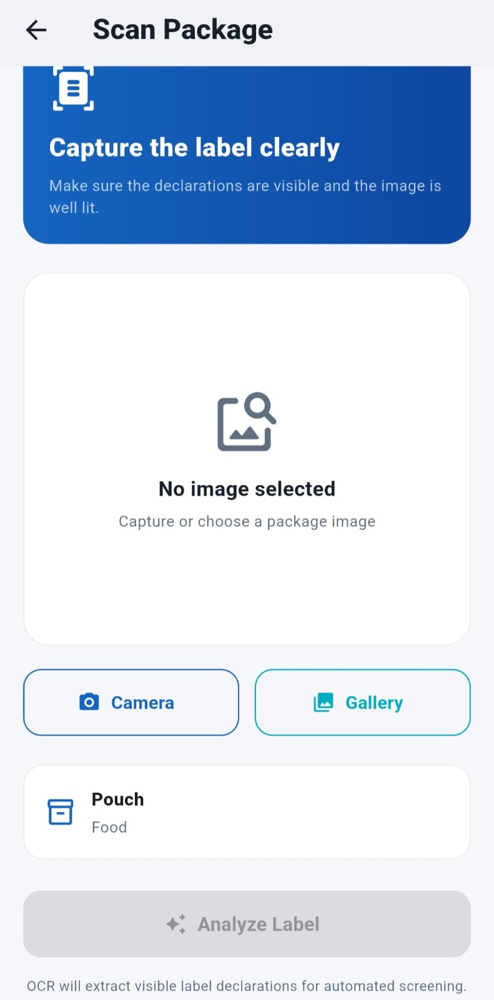
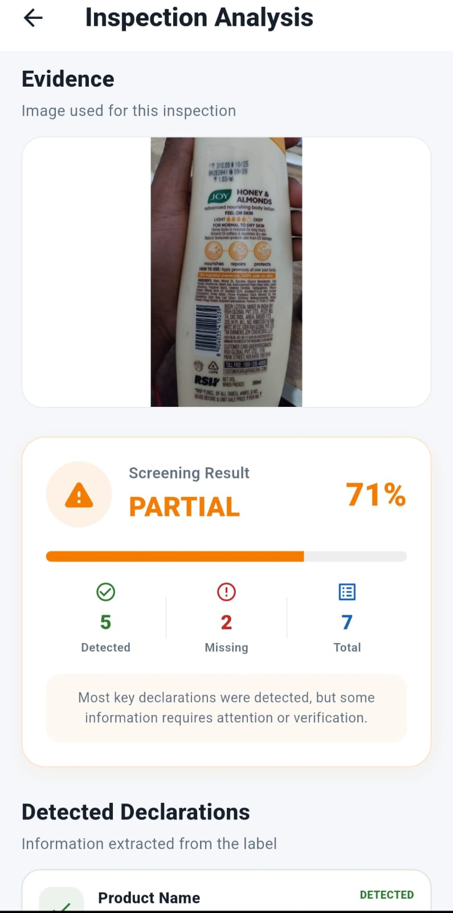
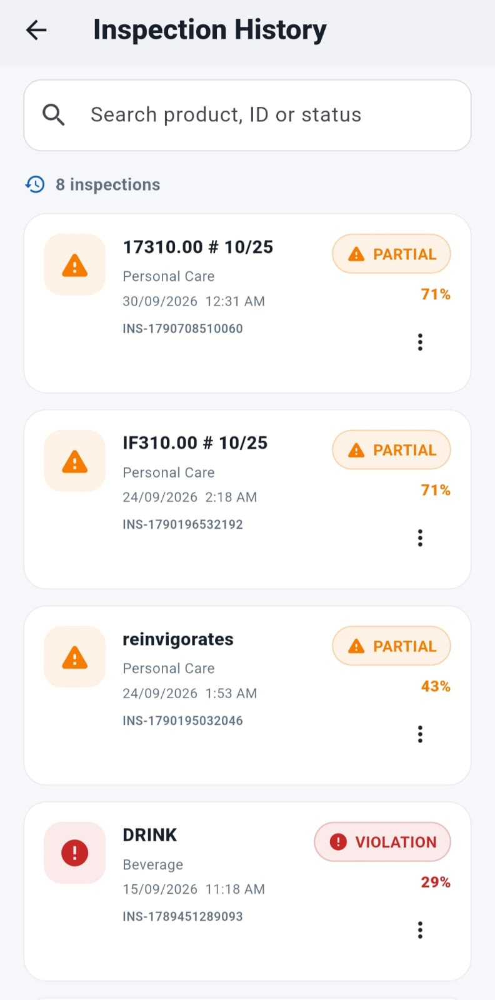
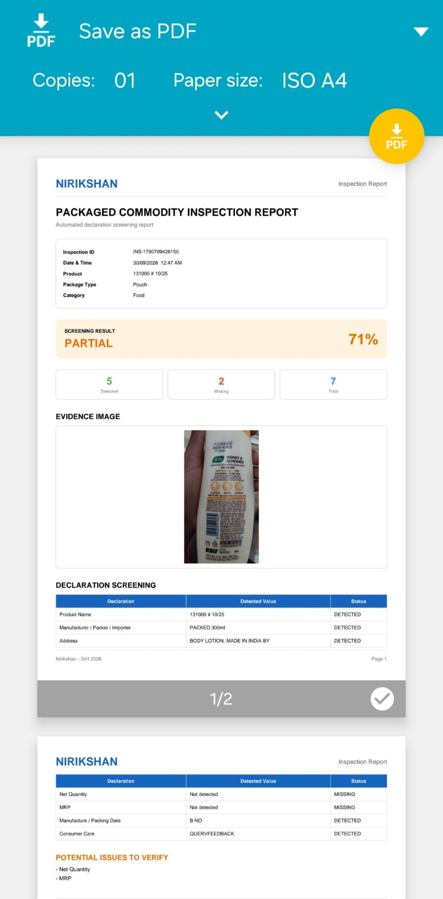

# NIRIKSHAN

### AI-Assisted Packaged Product Inspection Assistant

## 📦 Download

 &nbsp; &nbsp;&nbsp;&nbsp;
 &nbsp;&nbsp;&nbsp;&nbsp;
 &nbsp;&nbsp;&nbsp;&nbsp;
 &nbsp;&nbsp;&nbsp;&nbsp;
&nbsp;&nbsp;&nbsp;&nbsp;

## ✨ What Nirikshan Can Do

| 📷 Capture | 🔎 Analyze | 📋 Screen |
|---|---|---|
| Capture or upload package images | Extract text using OCR | Check configured declarations |

| 🚨 Identify | 📝 Document | 📄 Report |
|---|---|---|
| Highlight potential issues | Add inspector notes | Generate PDF reports |

## ⚡ How It Works

**01 — Capture**

📷  
Capture or upload a package photograph.

↓

**02 — Extract**

🔎  
Google ML Kit extracts visible text.

↓

**03 — Identify**

📋  
Nirikshan identifies important declarations.

↓

**04 — Screen**

⚙️  
The rule engine performs declaration screening.

↓

**05 — Verify**

👤  
Inspector reviews potential issues.

↓

**06 — Report**

📄  
Generate an evidence-backed PDF report.

NIRIKSHAN
                        │
                        ▼
              ┌──────────────────┐
              │  Flutter / Dart  │
              └────────┬─────────┘
                       │
                       ▼
              ┌──────────────────┐
              │ Camera / Gallery │
              └────────┬─────────┘
                       │
                       ▼
              ┌──────────────────┐
              │   Google ML Kit  │
              │       OCR        │
              └────────┬─────────┘
                       │
                       ▼
              ┌──────────────────┐
              │ Declaration      │
              │ Parser           │
              └────────┬─────────┘
                       │
                       ▼
              ┌──────────────────┐
              │ Rule-Based       │
              │ Screening Engine │
              └────────┬─────────┘
                       │
             ┌─────────┴─────────┐
             ▼                   ▼
       Potential Issues      Detected Data
             │                   │
             └─────────┬─────────┘
                       ▼
              ┌──────────────────┐
              │ Inspector Review │
              └────────┬─────────┘
                       │
                ┌──────┴──────┐
                ▼             ▼
             History        PDF Report

## 🧩 Current Prototype

✅ Flutter Android application  
✅ Camera / gallery input  
✅ Google ML Kit OCR  
✅ Declaration extraction  
✅ Rule-based screening  
✅ Evidence image  
✅ Inspector notes  
✅ Local inspection history  
✅ PDF report generation  

## 🔮 Production Roadmap

🔄 Advanced image preprocessing  
🔄 Multilingual OCR  
🔄 Placement verification  
🔄 Readability analysis  
🔄 Advanced computer vision  

🔮 FastAPI backend  
🔮 PostgreSQL  
🔮 Cloud synchronization  
🔮 Web dashboard  
🔮 Role-based authentication
